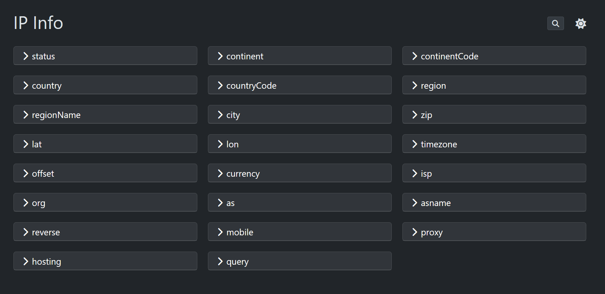
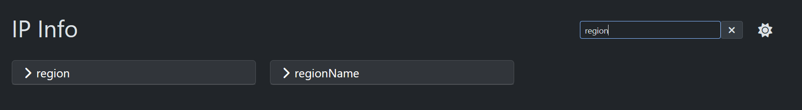

# go-ipinfo

Docker image that gives you information based on the ip address from [ip-info.com](https://ip-api.com/)

## Usage:
1. Clone repo 
   ```bash
   git clone git@github.com:ondrovic/ipinfo.git 
   ```
2. Deploy
   ```bash
    docker compose up -d
   ```
3. Navigate [here](http://localhost:8080/json) for raw json
    
    Observe
    <details>
    <summary>Example IP</summary>
    
    ```json {
    "status": "success",
    "continent": "",
    "continentCode": "",
    "country": "",
    "countryCode": "",
    "region": "",
    "regionName": "",
    "city": "",
    "district": "",
    "zip": "",
    "lat": 0.00,
    "lon": 0.00,
    "timezone": "",
    "offset": -0,
    "currency": "",
    "isp": "",
    "org": "",
    "as": "",
    "asname": "",
    "reverse": "",
    "mobile": false,
    "proxy": false,
    "hosting": false,
    "query": "0.0.0.0"
    ```
    </details>
4. Navigate [here](http://localhost:8080/html) from rendered template

   Observe

